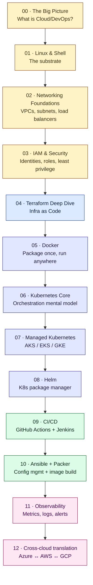

# Cloud & DevOps Engineering — a learning journey

> *A public, hands-on walk from **"I write application code"** to **"I own the infrastructure that runs it."** Every concept explained from first principles, every command dissected flag by flag, every lab reproducible on your own machine.*

<p align="center">
  <em>You don't need to know all of Cloud/DevOps. You need to understand one story — and know which tool plays which role in it.</em>
</p>

---

## The one story that ties everything together

```mermaid
flowchart LR
    Code[/"👩‍💻  Code<br/>on a laptop"/]:::start
    Package["📦  Package<br/>as a container"]
    Place["🏗️  A place<br/>to run it"]
    Config["🔧  Configured<br/>correctly"]
    Belt["🚚  Delivered<br/>automatically"]
    Watch["🔭  Watched<br/>in production"]
    Users[/"🌐  Users"/]:::end

    Code --> Package --> Place --> Config --> Belt --> Users
    Watch -.-> Place
    Watch -.-> Users

    classDef start fill:#dbeafe,stroke:#1e40af,color:#0b1f4d
    classDef end fill:#dcfce7,stroke:#166534,color:#052e16
```

Every tool on every Cloud/DevOps job posting maps to **one link in that chain**. Once you can name the link, the tool stops feeling like jargon:

| Link in the story                             | The tool category                | Examples you'll meet                  |
| --------------------------------------------- | -------------------------------- | ------------------------------------- |
| Package the app so it runs identically anywhere | **Containers**                   | Docker                                |
| A place to run it (rented, elastic, on-demand) | **The cloud**                    | AWS, Azure, GCP                       |
| Describing "the place" in version-controlled code | **Infrastructure as Code (IaC)** | Terraform, CloudFormation, Bicep      |
| Configuring servers repeatably                | **Configuration management**     | Ansible, Puppet, Chef                 |
| Pre-baking machine images                     | **Image build**                  | Packer                                |
| Running hundreds of containers self-healing   | **Container orchestration**      | Kubernetes (AKS / EKS / GKE)          |
| Packaging a Kubernetes app in one command     | **K8s package manager**          | Helm                                  |
| From `git push` to running in production      | **CI/CD**                        | GitHub Actions, Jenkins, GitLab CI    |
| Knowing what production is doing              | **Observability**                | Prometheus + Grafana, ELK, CloudWatch |

Underpinning all of it: **Linux, shell scripting, networking, security & IAM, troubleshooting**. Those are the substrate — the fluency that separates *"I copy-pasted a tutorial"* from *"I can debug this at 3am."*

---

## What this repo is (and isn't)

**What it is** 📚
- A **learning journal** built in public, module by module, in **storytelling voice** — the "why" always precedes the "how."
- **Hands-on first**: every module ships with commands you can copy-paste on your own laptop, with the *actual outputs* from a real session — not fabricated snippets.
- **Cross-cloud portable**: labs run on Azure (that's the cloud the author has access to), but every concept is written with the Azure ↔ AWS ↔ GCP mapping made explicit, so an AWS learner can follow the same path.
- **Command-by-command breakdowns**: every flag on every command is explained. You should never need to open `man` alongside this repo.

**What it isn't** 🙅
- Not a certification cram — no *"memorize these 300 flashcards"* pages.
- Not a tool showcase — no *"look at 40 tools"* without a story.
- Not framework worship — the point is the *concepts*; the tool that implements them is interchangeable.

---

## Who this is for

You'll get the most from this repo if you're:

- 🌱 A **junior developer** who ships code but has never provisioned the infrastructure it runs on.
- 🔁 A **student or bootcamp grad** wanting a durable, referenceable model of the DevOps stack — not just a video course.
- 🧭 An **AWS learner** who wants to see the Azure equivalents (and vice versa) side-by-side.
- 🔧 A **self-taught engineer** who has used bits of Docker, some Terraform, some Kubernetes, and wants a spine that connects them.

You don't need infra experience to start. You do need to be comfortable in a terminal.

---

## How to use this repo

Two modes:

1. **Follow the path linearly** — start at Module 00, do every hands-on, commit your own notes in a fork. This mirrors how the repo was written and is the best way to build the mental model.
2. **Cherry-pick a module** — every module has:
   - `README.md` (the *story* — concepts + why + diagrams),
   - `hands-on.md` (the *exact* commands run, with outputs and lessons),
   - and sometimes a `labs/` folder with Terraform / Helm / Ansible / etc. code.

If you're new to the terminal or Linux, do at least Modules 00 and 01 first — everything after leans on them.

---

## The learning path



### Progress tracker

| # | Module | Status |
|---|---|---|
| 00 | The Big Picture: what is Cloud/DevOps? | 🟢 published |
| 01 | Linux & Shell for DevOps | 🟢 in progress |
| 02 | Networking Foundations | ⚪ planned |
| 03 | IAM & Security | ⚪ planned |
| 04 | Terraform Deep Dive | ⚪ planned |
| 05 | Docker Fundamentals + Advanced | ⚪ planned |
| 06 | Kubernetes Core (on `kind`) | ⚪ planned |
| 07 | Managed Kubernetes (AKS / EKS / GKE) | ⚪ planned |
| 08 | Helm | ⚪ planned |
| 09 | CI/CD: GitHub Actions + Jenkins | ⚪ planned |
| 10 | Ansible + Packer | ⚪ planned |
| 11 | Observability | ⚪ planned |
| 12 | Cross-cloud translation (Azure ↔ AWS ↔ GCP) | ⚪ planned |

Legend: 🟢 available · 🟡 partial · ⚪ planned

---

## Ground rules the labs follow

Because these labs run on a real cloud account (with real, if small, billing risk), every hands-on chapter follows the same discipline. If you're following along on your own cloud, adopt these too — they scale from "learner sandbox" to "production":

1. 🏷️ **Every resource is tagged.** `owner=<you> purpose=learning` or similar. Untagged infra is orphaned infra.
2. 🧹 **Every session ends with a teardown.** The last command in every `hands-on.md` deletes what the session created. No zombie resources.
3. 📛 **Naming is prefixed.** `learn-*` (or your chosen prefix) so you can instantly filter your stuff from real stuff on shared accounts.
4. 🧾 **Everything is committed.** No side notes. If a decision, a debug session, or a lesson didn't make it into a commit, it didn't happen.
5. 🔐 **Never commit secrets.** The repo `.gitignore` covers state files, `.env*`, `*.pem`, `*.key`. Use environment variables locally, GitHub Actions encrypted secrets for pipelines, a cloud key vault for production.

---

## Repo layout

```
├── README.md                 ← you are here
├── docs/
│   ├── 00-setup/
│   │   ├── README.md           ← the "big picture" story
│   │   ├── mapping-your-cloud-access.md
│   │   ├── asking-for-cloud-access.md
│   │   └── hands-on.md         ← session log for Module 00
│   ├── 01-linux-shell/
│   │   ├── README.md
│   │   └── hands-on.md
│   └── NN-<topic>/…
├── labs/                     ← runnable code (Terraform, Helm, Ansible, workflows)
│   └── NN-<topic>/
└── cheatsheets/              ← one-page cram sheets per tool
```

---

## Contributing & feedback

Found something wrong, confusing, or worth adding? Open an issue — this repo is meant to grow with better explanations, better diagrams, and better lab exercises.

---

## Attribution

Written by [chishty313](https://github.com/chishty313) as a public learning journal. If any part of it saves you an hour, that's the whole point — star the repo so others can find it too. ⭐
