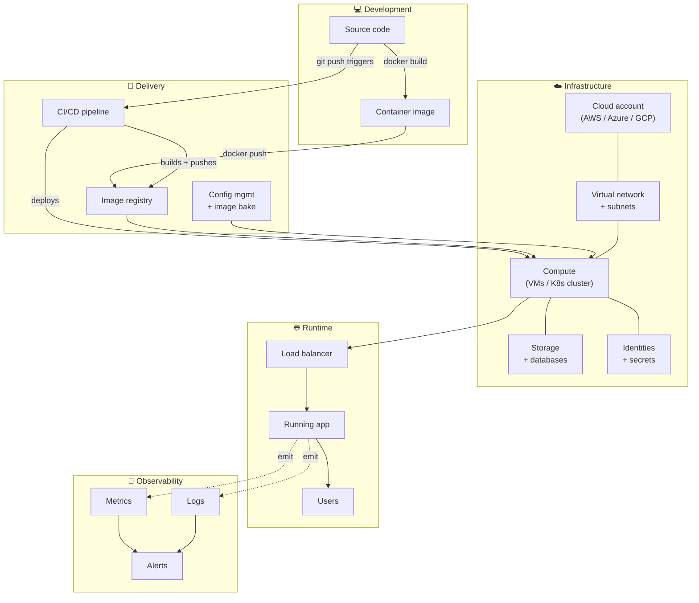

# Module 00 — The Big Picture: what is Cloud/DevOps engineering?

> *Before you touch a single tool, hold the whole story in your head. If you skip this step, you'll spend months learning tools without knowing which slot they fill.*

## The story in one paragraph

A team has an application. Someone has to **give the application a place to run** — a server, a container, a cluster of them. Someone has to **describe that place in code** so it can be re-created, code-reviewed, version-controlled. Someone has to **install the software onto that place** — repeatably, without hand-editing config files at 2am. Someone has to build a **conveyor belt** that takes a `git push` and delivers a running new version to real users on its own. And someone has to **watch** the whole system, because in production, what you cannot see will hurt you.

Every tool in Cloud/DevOps — Terraform, Docker, Kubernetes, Helm, Ansible, Packer, GitHub Actions, Prometheus, all of them — plays a role in exactly one part of that story. Once you know which part each tool serves, the field stops feeling like a hundred disconnected buzzwords.

---

## Visualising the story



Read the diagram left-to-right, top-to-bottom. The **dashed lines** are observability — always present, never in the critical path. The **solid arrows** are the delivery path from source code to a user.

---

## Which tool plays which role

The tools listed on almost every Cloud/DevOps job post map to those boxes cleanly:

| Diagram box                         | Category                    | Common tools                            |
| ----------------------------------- | --------------------------- | --------------------------------------- |
| Container image                     | Containers                  | Docker, Buildah, Kaniko                 |
| Cloud account, VPC, Compute, etc.   | Cloud                       | AWS, Azure, GCP                         |
| *"Describing infra in code"*        | Infrastructure as Code      | Terraform, Pulumi, CloudFormation, Bicep |
| Compute → K8s cluster               | Container orchestration     | Kubernetes (AKS/EKS/GKE)                |
| *"Installing a K8s app cleanly"*    | K8s package manager         | Helm                                    |
| Config mgmt                         | Configuration management    | Ansible, Puppet, Chef                   |
| Image bake                          | Machine image build         | Packer                                  |
| CI/CD                               | Continuous integration/delivery | GitHub Actions, Jenkins, GitLab CI  |
| Image registry                      | Container registry          | Docker Hub, ECR, ACR, GHCR              |
| Identities + secrets                | IAM + secrets               | AWS IAM, Entra ID + RBAC, GCP IAM, Vault, Key Vault, Secrets Manager |
| Metrics / logs / alerts             | Observability               | Prometheus, Grafana, Loki, ELK, CloudWatch, Azure Monitor |

Substrate skills (Linux, shell, networking, security fundamentals) sit *under* every box in that diagram.

---

## The three clouds at a glance

You'll almost certainly work in more than one cloud in your career. The concepts are 90% identical — only the names change. Memorise this table once and translation becomes free:

| Concept                       | AWS                     | Azure                        | GCP                                     |
| ----------------------------- | ----------------------- | ---------------------------- | --------------------------------------- |
| Compute (VMs)                 | EC2                     | Virtual Machine              | Compute Engine                          |
| Managed Kubernetes            | **EKS**                 | **AKS**                      | **GKE**                                 |
| Container registry            | ECR                     | ACR                          | Artifact Registry                       |
| Object storage                | S3                      | Blob Storage                 | Cloud Storage                           |
| Virtual network               | VPC                     | VNet                         | VPC                                     |
| Subnets                       | Subnets (per AZ)        | Subnets                      | Subnets (regional)                      |
| Load balancer (L4)            | NLB                     | Load Balancer (Standard)     | Network LB                              |
| Load balancer (L7)            | ALB                     | Application Gateway          | HTTPS LB                                |
| DNS                           | Route 53                | Azure DNS                    | Cloud DNS                               |
| Managed relational DB         | RDS                     | Azure SQL                    | Cloud SQL                               |
| Secrets                       | Secrets Manager         | Key Vault                    | Secret Manager                          |
| Identity + roles              | IAM                     | Entra ID + RBAC              | Cloud IAM                               |
| CI-friendly identity          | IAM Role + OIDC         | Managed Identity / Workload ID | Service Account + Workload Identity Federation |
| Serverless functions          | Lambda                  | Functions                    | Cloud Functions                         |
| Monitoring                    | CloudWatch              | Azure Monitor                | Cloud Monitoring                        |
| Logs                          | CloudWatch Logs         | Log Analytics                | Cloud Logging                           |
| Infra-as-code (native)        | CloudFormation / CDK    | ARM / Bicep                  | Deployment Manager                      |
| Infra-as-code (cross-cloud)   | **Terraform**           | **Terraform**                | **Terraform**                           |

Cross-cloud IaC via Terraform is why Terraform is *the* skill on almost every Cloud/DevOps posting — it's the one lever that works everywhere.

---

## Your workstation — the tools you need

Every module in this repo runs from your local terminal. The full toolbox by the end of Module 10:

| Tool                | Category                | Why you need it                              |
| ------------------- | ----------------------- | -------------------------------------------- |
| `git`               | Version control         | The universal substrate                      |
| `gh`                | GitHub CLI              | Repo + workflow ops without leaving the terminal |
| A cloud CLI (`az`, `aws`, or `gcloud`) | Cloud API access | Talk to your cloud without the portal |
| `docker`            | Containers              | Build, run, ship images                      |
| `kubectl`           | Kubernetes client       | Talk to any K8s cluster                      |
| `helm`              | K8s package manager     | Install & template chart-based apps          |
| `kind` (Kubernetes-in-Docker) | Local K8s      | Run a real K8s cluster on your laptop        |
| `terraform`         | Infrastructure as Code  | The Cloud/DevOps lingua franca               |
| `ansible`           | Configuration mgmt      | Configure servers repeatably                 |
| `packer`            | Image build             | Bake pre-configured VM/cloud images          |

### Verify (macOS)

```bash
which git gh docker kubectl helm terraform ansible packer
az --version   # or: aws --version, or: gcloud --version
```

Anything missing is an install-with-Homebrew away (`brew install <tool>`; for HashiCorp tools you'll first `brew trust hashicorp/tap`).

---

## Working with the cloud account you actually have

The labs in this repo were written on an Azure account with **narrow permissions** — Owner on one resource group, Reader on the wider subscription. That's more realistic than it sounds: most real jobs give you scoped access, not god-mode. The [`mapping-your-cloud-access.md`](./mapping-your-cloud-access.md) doc walks through *how to figure out what you can and can't do* on any cloud account, using this repo's real access as the worked example — a skill you'll use every time you're onboarded to a new team.

If your access is missing something the module needs, [`asking-for-cloud-access.md`](./asking-for-cloud-access.md) has a template for requesting exactly what you need from an admin, without over-asking.

For services this repo can't run on the author's Azure sub (AKS, ACR, Key Vault), the modules substitute cleanly with local equivalents — the concepts and the code you write are the same:

| Service you'd use in production | Local substitute for labs         | Why it works                                                     |
| ------------------------------- | --------------------------------- | ---------------------------------------------------------------- |
| Managed Kubernetes (AKS / EKS)  | **kind** (K8s in Docker)          | Same Kubernetes API, same `kubectl`, same manifests, same Helm.  |
| Container registry (ACR / ECR)  | **GitHub Container Registry (GHCR)** | Industry-standard, free for public images, real OCI registry.  |
| Cloud secret store (Key Vault)  | Gitignored `.env.local` + GH Actions secrets | Enough for learning; production secret retrieval is a 20-line addition on top of a working app. |

---

## What Module 01 covers

Module 01 is **Linux & Shell for DevOps** — the substrate under every box in that big diagram. You already know Linux at the *"I've opened a terminal"* level; Module 01 levels you up to *"I can navigate any Linux box under interview pressure."* It's done entirely on your laptop, no cloud needed, so you can start immediately after skimming this module.

👉 **Start Module 01 →** [`docs/01-linux-shell/README.md`](../01-linux-shell/README.md)
