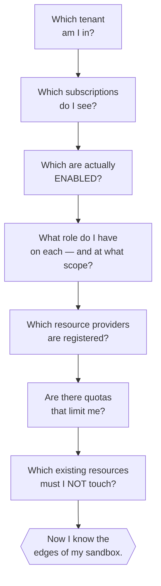

# Mapping your cloud access before you start

> *If you begin your Cloud/DevOps journey by immediately launching resources, you'll spend the first three days blocked by permission errors you don't understand. Spend fifteen minutes up front understanding the shape of your access, and you save hours every week after.*

## Why this comes before every other lab

Cloud access is almost never "yes / no". It's a *layered* system: you're a user in a tenant, you might have zero, one, or many subscriptions attached, and inside each subscription you might have god-mode, narrow scope, or read-only. On top of that, the resource *providers* (AKS, Key Vault, etc.) each have to be turned on at the subscription level before anyone can create them.

Every seasoned Cloud/DevOps engineer has learned to walk through the same checklist on day one of a new job:



This doc walks through that checklist with commands that work on Azure. AWS and GCP have direct equivalents — the *questions* are identical.

---

## Step 1 — Which tenant, which subscriptions?

On Azure the CLI keeps a cached list of subscriptions. That cache lies to you the moment your admin adds a new one or MFA policies change. Always refresh:

```bash
az login                               # if not already
az account list --refresh --all --output table
```

**Command breakdown:**
- `az account list` — dump every subscription your CLI knows about.
- `--refresh` — round-trip to Azure to update the cache (skip this and you'll be looking at last week's world).
- `--all` — include subs across every tenant you've logged into.
- `--output table` — human-readable columns.

You should see one row per subscription with `State` (Enabled/Disabled) and `IsDefault`. **A Disabled sub is dead weight** — someone let a spending limit lapse. **Multiple Enabled subs in different tenants is normal** in real jobs.

### If a sub you *expected* is missing

Almost always it's in a tenant your CLI has never logged into. Log in explicitly:

```bash
az login --tenant <tenant-id-or-domain>
```

The `--tenant` flag is essential. Without it, `az login` defaults to your home tenant, which is often *not* the one that owns the sub you want. Multi-tenant access is the rule, not the exception, in enterprise environments.

---

## Step 2 — What role do I have, and where?

The correct question is not *"am I Owner?"* — it's *"at what scope am I Owner, and what am I *not* Owner at?"* Azure scopes are hierarchical:

```
management group  →  subscription  →  resource group  →  individual resource
```

A role assigned at one level flows *down*. Contributor at subscription level = Contributor on every RG in it. Owner on one RG = you can do anything **inside that RG** but nothing outside.

The naive command to check:

```bash
az role assignment list --assignee <you@example.com> --output table
```

...often fails with `Insufficient privileges to complete the operation` on tenants that block directory reads for regular users. That's a tenant policy, not a lack of RBAC. The workaround: query by object id, which skips Graph:

```bash
# First, find your object id in this tenant:
az ad signed-in-user show --query id -o tsv 2>/dev/null \
  || echo "Directory read blocked — find your object id from the error message of any failed write."

# Then:
az role assignment list \
  --assignee-object-id <your-object-id> \
  --all --output table
```

**Command breakdown:**
- `--assignee-object-id` — bypasses the Graph lookup that resolves an email into an object id (Graph reads are what get blocked).
- `--all` — includes RBAC at management group, subscription, RG, and individual-resource scopes.
- Any failed write command in Azure returns an error containing your object id — you can copy it from there if the `signed-in-user` call is blocked.

Read the output carefully. The `Scope` column tells you *where* each role applies. **Owner scoped to `/subscriptions/…/resourceGroups/<name>` is not the same as Owner scoped to `/subscriptions/…`.** Portal breadcrumbs sometimes obscure this — always look at the raw scope string.

### A worked example (this repo's real access)

```
Principal                                     Role   Scope
────────────────────────────────────────────  ─────  ────────────────────────────────────────────
chishty_niftyitsolution.com#EXT#@example.com  Owner  /subscriptions/56397b98-…/resourceGroups/niftyexp
```

One row. Interpretation:

- ✅ Can create and delete anything **inside the `niftyexp` RG**.
- ✅ Can *read* other RGs in the subscription (implicit Reader for anyone in the directory).
- ❌ Cannot create *new* resource groups.
- ❌ Cannot register subscription-level resource providers.
- ❌ Cannot touch resources in any other RG.

**This is what the labs in this repo were built against.** Every lab resource lives inside that one RG, tagged `owner=chishty purpose=learning`, and gets torn down at the end of each session. That discipline is what turns *"tiny sandbox"* into *"enough to learn everything."*

---

## Step 3 — Which resource providers are registered?

An Azure subscription is a set of switches, and every service (AKS, ACR, Key Vault, etc.) has its own on/off switch called a *resource provider*. If the provider is `NotRegistered`, nobody — not even a Contributor inside a specific RG — can create resources of that type.

```bash
az provider list --query "[].{Provider:namespace, State:registrationState}" --output table
```

The ones that matter across the modules in this repo:

| Provider                      | Registered? | What it unlocks                                            |
| ----------------------------- | ----------- | ---------------------------------------------------------- |
| `Microsoft.Compute`           | usually yes | Virtual Machines, VMSS, disks                              |
| `Microsoft.Network`           | usually yes | VNets, subnets, NSGs, LBs, public IPs                      |
| `Microsoft.Storage`           | usually yes | Storage accounts (blob/queue/table/file)                   |
| `Microsoft.OperationalInsights` | usually yes | Log Analytics workspaces                                 |
| `Microsoft.ContainerService`  | often no    | **AKS** (Azure Kubernetes Service)                         |
| `Microsoft.ContainerRegistry` | often no    | **ACR** (Azure Container Registry)                         |
| `Microsoft.KeyVault`          | often no    | **Key Vault** (managed secrets store)                      |

Register a missing provider (needs subscription-level Contributor or Owner):

```bash
az provider register --namespace Microsoft.ContainerService
```

If you get `AuthorizationFailed` on that, you need an admin — see [`asking-for-cloud-access.md`](./asking-for-cloud-access.md).

---

## Step 4 — Quotas

Even with permissions, quotas cap you. Check VM cores in the region you'll use:

```bash
az vm list-usage --location <region> --output table | grep -i cores
```

Learners typically use `Standard_B2s` (2 vCPUs) VMs, so a 10-vCPU quota holds five concurrent VMs — plenty. Ask an admin to raise it if you're building larger scenarios.

---

## Step 5 — What's already there? (safety scan)

If your account is shared with real workloads (very common in learning-on-a-real-cloud scenarios), list what already exists so you never touch it accidentally:

```bash
az group list --output table
az resource list --resource-group <your-scoped-RG> --output table
```

Then adopt a **naming prefix** for everything you create (`learn-*`) and a **tag pair** for filtering (`owner=<you>`, `purpose=learning`). Cleanup at the end of a session becomes one command:

```bash
az resource list --resource-group <your-scoped-RG> --tag purpose=learning \
  --query "[].id" -o tsv | xargs -r -n1 az resource delete --ids
```

---

## The AWS and GCP equivalents (cheat-sheet)

| Step                          | Azure                                      | AWS                                         | GCP                                          |
| ----------------------------- | ------------------------------------------ | ------------------------------------------- | -------------------------------------------- |
| List accounts/projects        | `az account list --refresh --all`          | `aws sts get-caller-identity`, `aws organizations list-accounts` | `gcloud projects list`               |
| List your roles               | `az role assignment list --assignee-object-id …` | `aws iam list-attached-user-policies`, `aws iam list-groups-for-user` | `gcloud projects get-iam-policy <project>` |
| Check service enablement      | `az provider list`                         | *(services are always available; quotas gate them)* | `gcloud services list --enabled`     |
| Check quotas                  | `az vm list-usage --location <region>`     | `aws service-quotas list-service-quotas --service-code ec2` | `gcloud compute regions describe <region>` |
| List existing resources safely | `az resource list -g <rg>`                | `aws resourcegroupstaggingapi get-resources` | `gcloud asset search-all-resources`         |

Do this walkthrough on **any new cloud account** on day one. It's the fastest way to avoid a whole class of "why doesn't this work" frustrations.

---

## Once you've mapped your access

You now know:

- ✅ Which region(s) to build in
- ✅ Which resource types are available
- ✅ Which name prefix and tags to use
- ✅ Which existing resources to steer around
- ✅ What to ask an admin for, if anything ([template](./asking-for-cloud-access.md))

That's the whole point of this module — start every cloud journey with map-in-hand, not blind. Continue to [`../01-linux-shell/README.md`](../01-linux-shell/README.md) when ready.
