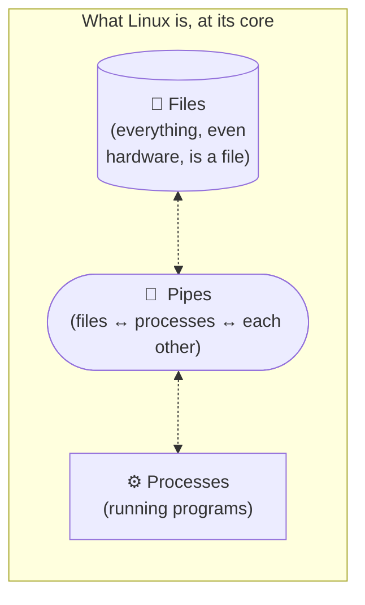
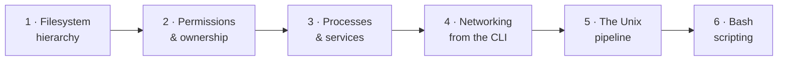
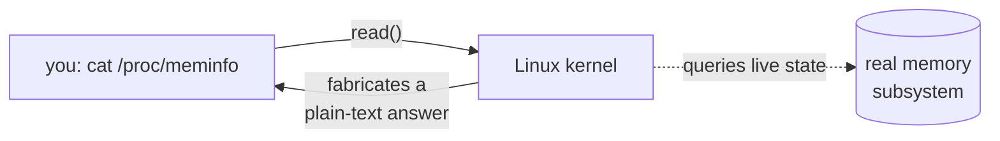

# Module 01 — Linux & Shell for DevOps

> *You don't need to know all of Linux. You need to know the 20% of Linux that shows up in 80% of on-call incidents and interview whiteboards.*

## The story

Every Cloud/DevOps interview eventually pulls up a terminal on a Linux box and says something like:

- *"A process is eating all the CPU. Find it and kill it."*
- *"This service isn't reachable from the outside. Walk me through debugging."*
- *"Write a bash script that rotates any log older than seven days."*

If the terminal is unfamiliar under pressure, no amount of Terraform vocabulary saves you. Linux fluency is the base of the pyramid every other Cloud/DevOps skill sits on.

The good news: you already know Linux at the level of *"I've used a terminal, I've SSH'd into a server once."* This module levels you up to *"I can navigate any Linux box under pressure."*

## The single mental model that unlocks Linux

Hold this in your head — everything else follows:



> **Linux is a system of files and processes, connected by pipes. Every command you'll ever run is one of: read a file, write a file, start a process, stop a process, or connect them together.**

That's the whole game. Once you accept that "listing users", "starting a web server", "watching network traffic", and "checking disk space" are all just *files or processes* dressed up in different commands, the tools stop feeling arbitrary.

---

## What this module covers, in order



Each concept follows a fixed shape: *why-it-exists* → *hands-on you run* → *lesson learned*. The hands-on log for the whole module lives in [`hands-on.md`](./hands-on.md).

---

## Concept 1 — The filesystem hierarchy that matters

### Historical context in one paragraph

Linux inherited its layout from Unix in the 1970s. Directories are grouped by *what kind of thing lives there*, not *which app owns it*. That's the opposite of Windows/macOS, where each app owns a folder in `Program Files` or `/Applications`. On Linux, one app's files are scattered across many directories — binaries in `/usr/bin`, config in `/etc/<app>`, logs in `/var/log/<app>`, runtime data in `/var/lib/<app>`. Once you know the categories, you know where to look on *any* Linux server without asking.

### The directories a DevOps engineer opens every day

```
/                       ← the root of the whole tree
├── etc/                ← system configuration
├── var/
│   ├── log/            ← log files
│   └── lib/            ← persistent state (databases, package DBs)
├── proc/               ← virtual: live view of the running kernel
├── sys/                ← virtual: kernel objects (devices, drivers)
├── tmp/                ← temporary, often wiped on reboot
├── run/                ← runtime state (pids, sockets)
├── home/<user>/        ← users' home directories
├── root/               ← root user's home
├── usr/
│   ├── bin/            ← programs from the OS package manager
│   └── local/bin/      ← programs installed by the admin
├── opt/                ← optional / hand-installed 3rd-party
├── dev/                ← device files (disks, terminals)
├── boot/               ← the kernel and bootloader files
└── mnt/, media/, srv/  ← mount points and misc conventions
```

The ones that dominate your day-to-day, and why they matter:

| Directory                            | What lives there                                                                                                        | Why you care                                                                                                                                        |
| ------------------------------------ | ----------------------------------------------------------------------------------------------------------------------- | --------------------------------------------------------------------------------------------------------------------------------------------------- |
| **`/etc`**                           | System-wide configuration files: `/etc/hosts`, `/etc/resolv.conf`, `/etc/ssh/sshd_config`, `/etc/nginx/nginx.conf`, ... | When a service misbehaves after *"someone changed something"*, 90% of the time the change is here.                                                  |
| **`/var/log`**                       | Log files: `/var/log/syslog`, `/var/log/auth.log`, `/var/log/nginx/access.log`.                                         | The first place you `tail -f` when something breaks.                                                                                                |
| **`/var/lib`**                       | Persistent state — databases, caches, package-manager state. `/var/lib/docker` for images/containers.                   | When *"the disk is full"*, the culprit almost always lives here.                                                                                    |
| **`/proc`**                          | A **virtual** filesystem — every running process has a directory `/proc/<pid>/`; the kernel exposes runtime info as pseudo-files. `/proc/meminfo`, `/proc/cpuinfo`, `/proc/net/tcp`. | Almost every *"show me system state"* tool (`ps`, `top`, `free`, `ss`) is really just reading files under `/proc`. Understanding this demystifies half of Linux. |
| **`/sys`**                           | Another virtual FS, exposing devices and kernel objects.                                                                | Rarely edit; check state when a device won't come up.                                                                                               |
| **`/tmp`**                           | Temporary. Wiped on boot on most systems (or by systemd-tmpfiles).                                                      | Never put anything you need to survive a reboot here. In containers, `/tmp` is often tiny — a common CI failure.                                    |
| **`/root`**                          | Root's home directory.                                                                                                  | When you're logged in as root, this is `~`.                                                                                                         |
| **`/home/<user>`**                   | Each non-root user's home.                                                                                              | Same as above for regular users.                                                                                                                    |
| **`/usr/bin`, `/usr/local/bin`, `/opt`** | Installed programs.                                                                                                     | When *"command not found"* strikes, `which <cmd>` tells you where the binary lives (or doesn't).                                                    |
| **`/run`**                           | Runtime state (pids, sockets) that shouldn't survive reboot.                                                            | Systemd stores unit socket files here.                                                                                                              |

### The `/proc` insight that changes how you think about Linux

`/proc` and `/sys` aren't real files on disk. They're **doors into the kernel**.



When you `cat /proc/meminfo`, you're **not** reading a file — you're asking the kernel a question, and the kernel is answering by *pretending* to be a file. That trick (making everything look like a file) is why the same tools — `cat`, `grep`, `cut` — work everywhere on Linux.

Once you get this, tools like `top`, `ps`, `free`, `df`, `ss` stop feeling magical. They're pretty-printers over `/proc` and `/sys`.

### Hands-on 1: prove the mental model in a real Linux container

Your Mac is Unix-flavoured but not Linux, and macOS's BSD `ls`, `sed`, and `grep` differ from GNU versions in ways that will bite you later. Every hands-on in this module runs inside a real Linux container — spin one up with Docker Desktop:

```bash
docker run --rm -it ubuntu:24.04 bash
```

**Command breakdown:**
- `docker run` — start a new container from an image.
- `--rm` — delete the container the moment we `exit`. Keeps the machine clean.
- `-it` — **`-i`** keeps stdin open, **`-t`** allocates a TTY. Together they mean "give me an interactive shell." Without them you can't type into the container.
- `ubuntu:24.04` — the image's name and tag. `ubuntu` is Canonical's official image; `24.04` is the current LTS.
- `bash` — the command to run inside the container. Overrides the image's default (which is also bash for this image, but being explicit is a habit worth building).

You should land in a `root@<hash>:/#` prompt — a real Ubuntu shell running in a container on your machine.

Inside the container, run each of these and observe:

```bash
ls /                                                   # top of the tree
ls /etc | head -20                                     # some system config
cat /etc/os-release                                    # machine-readable OS identity
cat /proc/meminfo | head -5                            # live memory state via /proc
cat /proc/cpuinfo | head -20                           # CPU info via /proc
ls /var/log                                            # bare-image log dir
exit
```

**What each command reveals:**

| Command                                | What you learn                                                                                                                            |
| -------------------------------------- | ----------------------------------------------------------------------------------------------------------------------------------------- |
| `ls /`                                 | The canonical top-level directories from the tree above.                                                                                  |
| `ls /etc \| head -20`                  | A peek at how much lives under `/etc` on a *bare* Ubuntu image (short — production servers have hundreds of entries).                     |
| `cat /etc/os-release`                  | Machine-readable OS identity. Every distro ships this. Portable scripts read this file to behave differently on Ubuntu vs. RHEL vs. Alpine. |
| `cat /proc/meminfo \| head -5`         | The **live** memory state of the container, being read from the kernel via `/proc`. This is the raw data `free -h` prettifies.            |
| `cat /proc/cpuinfo \| head -20`        | Same trick for the CPU. Notice: the container has no CPU of its own — it sees the host's CPU because containers share the host kernel.    |
| `ls /var/log`                          | See what logs a bare Ubuntu image ships with. Spoiler: very few — most logs appear once services start running.                           |

> [!IMPORTANT]
> **Architecture gotcha (Apple Silicon / ARM readers).**  On x86 Linux, `/proc/cpuinfo` includes a `model name : ...` line. On ARM64 Linux (which is what Docker Desktop runs on Apple Silicon Macs), there is **no `model name` field** — the ARM kernel uses different field names (`CPU implementer`, `CPU part`, `CPU architecture`).
>
> This is why a naive `grep '^model name' /proc/cpuinfo` command from a tutorial written for x86 will silently return nothing on ARM. It's a small example of a very large lesson: **CLI tools that assume a specific format across Linuxes will silently fail across architectures.** Cross-architecture awareness matters as soon as you touch containers, cloud instances (AWS Graviton, Azure Ampere), and multi-arch images.

### What to look for in your outputs

- `/etc/os-release` should tell you it's Ubuntu 24.04 (Noble Numbat).
- `/proc/meminfo` shows total, free, and available memory *for the container's cgroup*, not the host — this is the same view your app inside a container sees.
- `/var/log` on a bare Ubuntu image is small (`alternatives.log`, `apt`, `bootstrap.log`, `btmp`, `dpkg.log`, `faillog`, `lastlog`, `wtmp`). Two useful ones to remember:
  - `btmp` — failed login attempts (binary; view with `lastb`).
  - `wtmp` — successful logins/logouts (binary; view with `last`).
  - `lastlog` — last login time per user (binary; view with `lastlog`).

### Concept 1 — takeaway

- 🧭 Linux directory conventions are **shared across every distro** — once you learn them, you can land on any Linux box and know where to look.
- 🔍 **`/proc` is the door to the kernel.** Every "system state" tool reads from it. When a tool doesn't exist or misbehaves, you can often get the raw answer with `cat /proc/<something>`.
- ⚠️ **Format assumptions across architectures will silently fail.** Design commands defensively: check for empty output, or look for stable substrings (e.g. `grep -iE 'model|processor'` catches both x86 and ARM).

---

## Concept 2 — Permissions & ownership (coming next)

Every "permission denied" you've ever seen boils down to one of three questions. We'll answer them next.

*(this section fills in as we go)*
